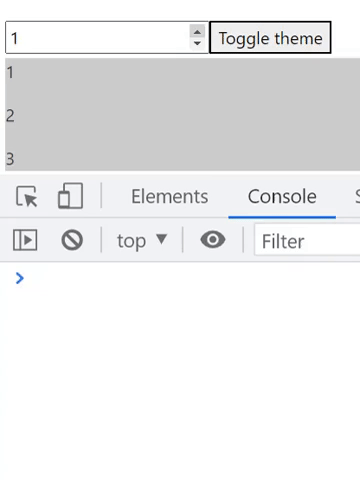
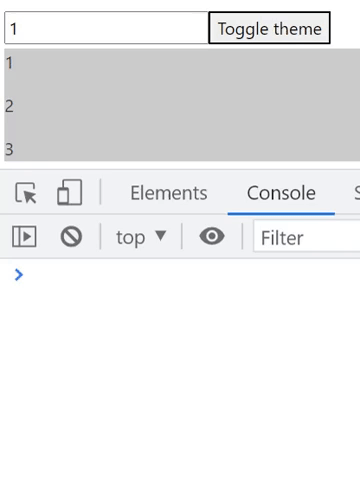

# useCallback

<div dir="rtl">
מאפשר לנו לזכור כתובת של פונקציה ולא ליצור אותה מחדש עד שיתנה ערך מסויים ולא כל רינדור.

שימושי כאשר מעבירים callback לילד שהם מסתמכים על שיוויון כתובות(דוגמא עם הסבר בהמשך), או כאשר **היצירה** של הפונקציה
לוקחת הרבה משאבים (בדרך כלל לא קורה).

אז לדוגמא יש לנו פונקציה שמחזירה מערך עם מספר שיש לנו בסטייט ועוד 1 ועוד 2, ואת הפונקציה הזאת מעבירים לבן.

בן הוא מעדכן את הסטייט שלו לפי הפונקציה, והוא משתמש ב useEffect כדי לעקוב אחרי שינויים בפונקציה (היא יכולה להשתמנות בגלל
הסטייט באבא).

אבל בגלל שאנחנו יוצרים את הפונקציה בתוך הקומפוננטה אז כל פעם שהיא תרנדר מחדש היא תיווצר שוב, ואז ה useEffect ירוץ בבן כי
הכתובת השתנתה.

ככה קורה שגם כאשר אין סיבה לשנות את הפונקציה היא משתנת, ומקבלת כתובת מחדש.

<div dir="ltr">

```js
export default function App() {
  const [number, setNumber] = useState(1);
  const [dark, setDark] = useState(false);

  const getItems = () => {
    return [number, number + 1, number + 2];
  };
  const theme = {
    backgroundColor: dark ? "#333" : "#CCC",
    color: dark ? "#CCC" : "#333",
  };
  return (
    <div align="center">
      <input
        type="number"
        value={number}
        onChange={(e) => setNumber(+e.target.value)}
      />
      <button onClick={() => setDark((prevState) => !prevState)}>
        Toggle theme
      </button>
      <div style={theme}>
        <List getItems={getItems}/>
      </div>
    </div>
  );
}

export default function List({getItems}) {
  const [items, setItems] = useState([]);
  useEffect(() => {
    setItems(getItems());
    console.log("update items");
  }, [getItems]);

  return (
    <div>
      {items.map((item) => (
        <p key={item}>{item}</p>
      ))}
    </div>
  );
}
```


</div>

אז כדי להימנע מסם רינדור מחדש של הפונקציה שתגרור רינדור מחדש של כל הקומפוננטה בבן אנחנו יכולים לזכור את הערך וככה לשנות
את הפונקציה רק כאשר יש שינוי ב number עצמו


<div dir="ltr">

```js
const getItems = useCallback(() => {
    return [number, number + 1, number + 2,];
  },
  [number]
);
```


</div>

> הבדל של useCallback מuseMemo הוא ש useCallback מקבל את הפונקציה בפנים, ו useMemo מקבל את הערך שמוחזר מהפונקציה
</div>