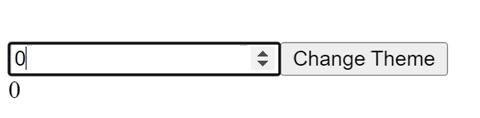
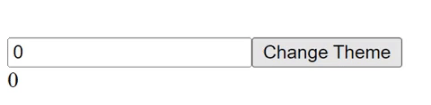
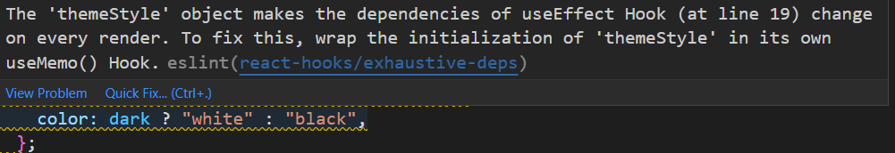
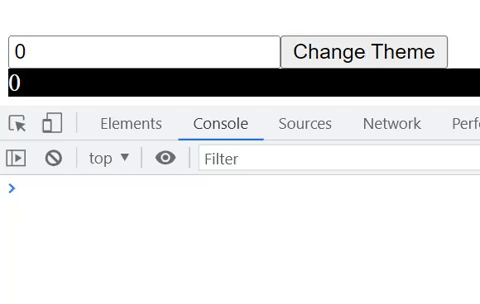

# useMemo

<div dir="rtl">
useMemo  מאפשר לנו לשנן (to memoized) ערך של משתנה מסויים.

### דוקומנטציה שלו

<div dir="ltr">

    useMemo<any>(factory: () => any, deps: DependencyList | undefined): any

    useMemo will only recompute the memoized value when one of the deps has change

</div>
אנחנו רואים ש useState מחזיר לנו ערך שיכול להיות מכל סוג, והוא מקבל שני משתנים:

* פונקציית חישוב (factory) - פונקציה שתחזיר את הערך שאותו נזכור.
* מערך תלויות (deps) - אופציונאלי, הפונקציה factory תרוץ רק כאשר אחד מהערכים מהרשימה ישתנה, אם לא העברנו מערך, הוא ייחשב
  את הערך כל רינדור.

**יש לנו שני שימושים עיקריים ל useMemo**

## חישוב כבד של ערך

אם יש לנו משתנה שהחישוב שלו לוקח זמן, והוא יכול לחסום לנו את הריצה של האפליקציה, אנחנו יכולים "לשנן" את הערך שלו, וככה
רק כאשר צריך לחשב את הערך שלו נעשה את זה.

לדוגמא: יש לנו ב state שני משתנים - אחד מספר ואחד משתנה בלואני שייקבע את ה theme.

אנחנו נחשב את המשתנה doubleNumber לפי פונקציה שלוקח לה הרבה זמן לרוץ.

נוכל לראות שכאשר אנחנו משנים את המספר לוקח לדף להתרנדר כמה שניות, וזה הגינוי כי לוקח לפונקציה שמחשבת את המספר לרוץ הרבה
זמן, אבל אפשר לראות שגם כאשר אנחנו משנים את הtheme לוקח לדף להגיב תוך כמה שניות, וזה קורה בגלל שהקומפוננטה מתרנדרת מחדש,
ולכן היא מחשבת עוד פעם את doubleNumber למרות שהערך שלו נשאר אותו דבר.

<div dir="ltr">

```js
const [number, setNumber] = useState(0);
const [dark, setDark] = useState(false);

const doubleNumber = slowFunction(number);

const themeStyle = {
  backgroundColor: dark ? "black" : "white",
  color: dark ? "white" : "black",
};

function slowFunction(n) {
  console.log("Calling Slow Function");
  for (let i = 0; i < 1000000000; i++) {
  }
  return n * 2;
}
```


</div>
כדי להימנע מהחישוב של doubleNumber כל פעם שהפונקציה מתרנדרת אפשר לשנן את הערך של number, ואז הוא יחשב את ערך רק כאשר אחנו באמת צריכים לחשב אותו.  
<div dir="ltr">

```js
 const doubleNumber = useMemo(() => {
  return slowFunction(number);
}, [number]);
```


</div>

## Referential Equality

ב js יש לנו הרבה משתנים שהם נשמרים by reference - כלומר הערך שנשמר המשתנה זה הכתובת זכרון של האובייקט.

אם נרצה לשמור על אותו אובייקט ממש, ולא להקצות לו כתובת חדשה כל רנדור מחדש נוכל להשתמש ב useMemo.

מתי נרצה שהאובייקט יישאר עם אותה כתובת? לדוגמא אם יש לנו useEffect שתלוי במערך או אובייקט אז הדרך הנכונה לבצע את זה היא
בעזרת useMemo.

דוגמא למה יקרה אם לא נשתמש ב useMemo:

אחנו נוכל לראות שגם כאשר נשנה את number, ה useEffect ירוץ, וזה בגלל שבכל רנדור הדפדפן יקצה מחדש את המשתנה themeStyle, אז
הכתובת שלו תשתנה, ואז ה useEffect ירוץ כי כבייכול היה שינוי במשתנה, למרות שבאמת הערך לא השתנה. אפשר לראות שב vscode הוא
מתריאה לנו על הבאג הזה.

<div dir="ltr">

```js
const [number, setNumber] = useState(0);
const [dark, setDark] = useState(false);

const themeStyle = {
  backgroundColor: dark ? "black" : "white",
  color: dark ? "white" : "black",
};

useEffect(() => {
  console.log("Theme Changed!");
}, [themeStyle]);
```




</div>

אז כדי ללפתור את הבאג הזה כל מה שנצטרך לעשות זה לשנן את הערך של themeStyle בתוך useMemo, ונגדיר לו שהוא ייחשב את ה theme
מחדש רק כשאר הערך dark יישתנה.

<div dir="ltr">

```js
const themeStyle = useMemo(() => {
  return {
    backgroundColor: dark ? "black" : "white",
    color: dark ? "white" : "black",
  };
}, [dark]);
```


</div>

## הערות

> צריך לשים לב ש useMemo נותן לנו גם overHead - הוא גם צריך לשמור את הערכים של ה מערך תלויות, וכל ריצה הוא ייקרה לפונקציה עצמה של useMemo (שבודקת אם צריך לקראות לפונקציה factory), לכן נשתמש ב useMemo רק כאשר אנחנו באמת צריכים.

>צריך לשים לב ש useMemo ירוץ בזמן הרינדור - צריך לשים לב לא לעשות דברים שיכולים לגרום לשגיאה (את זה נשאיר ל useEffect).

> אפשר לסמוך על useMemo בתור אופטימיזציה של ביצועים ולא להסתמך עליה. יכול להיות שריאקט "יישכח" כמה ערכים ולחשב אותם מחדש בעיבוד הבא (כדי לפנות זכרון). העצה היא לכתוב את הקוד שהוא יעבוד גם בלי ה useMemo, ולאחר מכן להוסיף אותו כדי לייעל את הביצועים.

> מבחינה קונספטואלית כל ערך שנמצא התוך הפונקציה שב useMemo, צריך להופיע גם במערך התלויות (בעתיד ריאקט יוסיפו compiler שיוסיף את המערך תלויות לבד).

</div>
