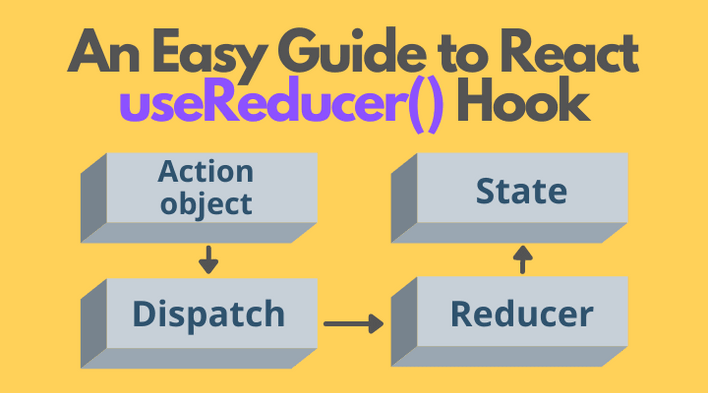

# useReducer

<div dir="rtl">

> לפי שהיה לנו את useReducer היינו משתמשים ב Redux כדי לנהל את הסטייט הגלובלי שלנו, אבל עם useReducer ו- useContext אפשר להגיע לאותה תוצאה בדיוק, ואפילו המימוש יהיה יותר קל.

מקבל פונקציית reducer, ו state התחלתי ומחזיר מערך עם הstate ופונקציית ה dispatch.
<div dir="ltr">

```js
const [state, dispatch] = useReducer(reducer, initialArg, init);
```

</div>

יש שתי דרכים לאתחל את ה state הראשוני:

1. הדרך הפשוטה היא פשוט להעביר את ה state כארגומנט שני

<div dir="ltr">

```js
const [state, dispatch] = useReducer(
  reducer,
  {count: initialCount}
);
```

</div>

2. "איחול עצל" - הארגומנט השני שנעביר יועבר לפנוקציה שנגדיר כארגומנט שלישי. זה מאפשר לנו להשתמש בלוגיקה יותר מורכבת כדי
   לחשב את הערך ההחלתי של ה state שלנו.(אם נגדיר את פונקציה חיצונית(כלומר לא חץ), נוכל בעזרתה לאחתל את ה state בקלות)

<div dir="ltr">

```js
function init(initialCount) {
  return {count: initialCount};
}

const [state, dispatch] = useReducer(reducer, initialCount, init);
```

</div>
useReducer מאפשר לנו לטפל ב state שהוא יותר מורכב מבדרך כלל או שהה state הנוכחי תלוי במצב הקודם שלו.
הוא מאפשר לנו גם לייעל את הביצועים אם יש לנו עדכונים מקומפוננטות שרחוקות אחת משנייה בעץ, מכיוון שאנחנו יכולים להעביר רק את הפונציה dispatch ולא callback שונים.

## שימוש

נגדיר את הפונקציית reducer, שם יהיה כל הפונקציות שנרצה לעשות על ה state שלנו. מה שיוחזר מפונקציה יהיה ה state החדש.
<div dir="ltr">

```js
const [state, dispatch] = useReducer(reducer, {count: 0});

export const ACTIONS = { // global object 
  INCREMENT: "increment",
  DECREMENT: "decrement",
};

function reducer(state, action) {
  switch (action.type) {
    case ACTIONS.INCREMENT:
      return {count: state.count + 1};
    case ACTIONS.DECREMENT:
      return {count: state.count - 1};
    default:
      return state;
  }
}


```

</div>
איך useReducer עובד בעצם? כדי לעדכן את state נשתמש בפונקציית dispatch, ובתוכה נעביר אובייקט שיכיל action ו- payload (
אופיונאלי), action שיגיד ל פונקציית ה reducer איזה פונקציה (action) להפעיל על ה state.

<div dir="ltr">

```js
function increment() {
  dispatch({type: ACTIONS.INCREMENT});
}

function decrement() {
  dispatch({type: ACTIONS.DECREMENT});
}
```



</div>

## שימוש יותר רציני

נניח שנרצה להכין אפליקציה של ניהול משימות, יהיו לנו בה בסך הכל שתי קומפוננטות: form להוסיף מטלה, וקומפוננטה שתציג את
המידע על המטלות. לצורך הדוגמא נשמור רק את השם של המטלה והאם המטלה בוצעה

### ה reducer

<div dir="ltr">

```js
function reducer(state, action) {
  switch (action.type) {
    case ACTIONS.ADD:
      return [...state, newTodo(action.payload.name)];
    case ACTIONS.COMPLETED:
      return state.map((todo) =>
        todo.id === action.payload.id ? {...todo, completed: true} : todo
      );
    case ACTIONS.DELETE:
      return state.filter((todo) => todo.id !== action.payload.id);
    default:
      return state;
  }
}
```

</div>

### הקומפוננטה שלנו

נעביר לקומפוננטה של ה Todo את הפונקציה dispatch, ושם יהיו את כל הפונקציות בפנים לפי ה type שנעביר

<div dir="ltr">

```js
const [todos, dispatch] = useReducer(reducer, []);
const [name, setName] = useState("");

function handleSubmit(e) {
  e.preventDefault();
  dispatch({type: ACTIONS.ADD, payload: {name: name}});
  setName("");
}

function newTodo(name) {
  return {id: Date.now(), name: name, completed: false};
}

return (
  <div style={{flexDirection: "column"}}>
    <form onSubmit={handleSubmit}>
      <input value={name} onChange={(e) => setName(e.target.value)}/>
    </form>
    {todos.map((todo) => (
      <Todo key={todo.id} todo={todo} dispatch={dispatch}/>
    ))}
  </div>
);


export function Todo({todo, dispatch}) {
  return (
    <div>
      <span style={{color: todo.completed ? "green" : "red"}}>
        {todo.name}
      </span>
      <button
        onClick={() =>
          dispatch({type: ACTIONS.COMPLETED, payload: {id: todo.id}})
        }
      >
        completed
      </button>
      <button
        onClick={() =>
          dispatch({type: ACTIONS.DELETE, payload: {id: todo.id}})
        }
      >
        delete
      </button>
    </div>
  );
}
```

</div>
</div>