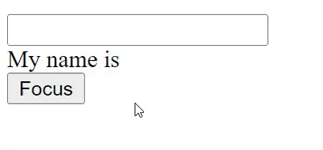
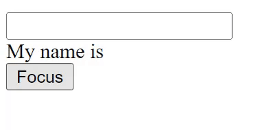
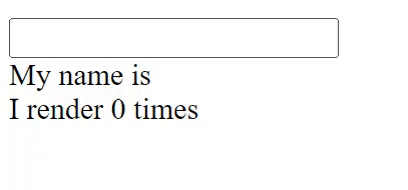
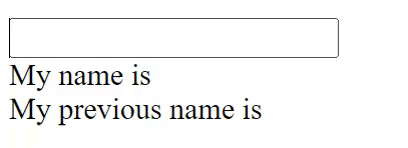

# useRef

<div dir="rtl">

<div dir="ltr">

```js
// function singiture:
function useRef<T>(initialValue: T): MutableRefObject<T>;

// use:
const refContainer = useRef(initialValue);
```

</div>
useRef מחזיר אובייקט ניתן לשינוי עם key אחד - current שהוא יהיה מאותחל ל initialValue שהעברנו. האובייקט שיוחזר יישאר לאורך כל הזמן שהקומפוננטה נמטת ב DOM (הוא לא ישתנה בין רינדורים - אם הוא מחזיק refrence לאלמנט בתוך ה DOM הוא כן יישתנה במידת הצורך).

התכלית של useRef בסופו של דבר היא להיות כמו "קופסה" שיכולה להחזיק ערך בר שינוי במאפיין ה current שלו.

ההדבל בין useRef לבין סתם ליצור אובייקט שייראה `{current : 0}` זה ש useRef ידאג לתת לנו את אותו אובייקט בכל רינדור.

כאשר אנחנו משנים את המאפיין של current הוא לא יגרופ לרינדור מחדש, אבל הוא כן יישתנה במקום שהוא נמצא.

שימושים של useRef:

* להצביע על אובייקט מה DOM
* הוא יכול לשמש כמו state, בלי הרינדור מחדש
* לשמור ערך קודם של ה state

## Reference Element

אם נרצה להצביע על אלמנט מסוים מה-DOM נוכל לעשות את זה בקלות בעזרת useRef.

דוגמא לשימוש - אנחנו נחזיק reference למשתנה של הinput ובכל פעם שנלחץ על הכפתור הוא ייכנס לתוך הinput (יעשה focus).
<div dir="ltr">

```js
const [name, setName] = useState("");
const inputRef = useRef();

function focus() {
  inputRef.current.focus();
}

return (
  <>
    <input
      ref={inputRef}
      value={name}
      onChange={(e) => setName(e.target.value)}
    />
    <div>My name is {name}</div>
    <button onClick={focus}>Focus</button>
  </>
);
```


</div>

צריך לשים לב לא לעשות פעולות שקושורות לuseEffect או דברים שמשנים את ה state.

לדוגמא:לא היינו רוצים לשנות את הערך של הinput ככה כי אז הstate לא ייתעדכן, ולא היינו רוצים להוסיף child עם useRef נ נגיד
ונשנה את הערך שב input בלחיצה של הכפתור, נוכל לראות שהסטייס לא יישתנה.
<div dir="ltr">

```js

inputRef.current.value = "some value";
```


</div>

## Like State

אפשר להשתמש בuseRef בשביל שהוא ישמש לנו בתור סטייט.

לדוגמא - אם נרצה לשמור את כמות הפעמים שהקומפוננטה התרנדרה נוכל לעשות את זה בעזרת useRef.
<div dir="ltr">

```js
const [name, setName] = useState("");
const renderCount = useRef(0); // object -> {current:0}
useEffect(() => {
  renderCount.current = renderCount.current + 1;
});

return (
  <>
    <input value={name} onChange={(e) => setName(e.target.value)}/>
    <div>My name is {name}</div>
    <div>I render {renderCount.current} times</div>
  </>
);
```



</div>
היתרון כאן זה שאם היינו משתמשים ב state כדי לעדכן את ה renderCount היינו מקבלים לופ אינסופי, בגלל שהוא היה מעדכן את הסטייט ומתרנדר מחדש פעם אחר פעם.
<div dir="ltr">

```js
const [name, setName] = useState("");
const [renderCount, setRenderCount] = useState(0);

useEffect(() => {  // לופ אינסופי
  setRenderCount((prevCount) => prevCount + 1);
});

return (
  <>
    <input value={name} onChange={(e) => setName(e.target.value)}/>
    <div>My name is {name}</div>
    <div>I render {renderCount.current} times</div>
  </>
);
```


</div>

## שמירת ערך קודם של הסטייט

אם נרצה לשמור ערך קודם של הstate נוכל לעשות את זה בעזרת useRef ו useEffect, כל מה שצריך לעשות זה בסך הכל שכאשר יש עדכון מstate מסויים אנחנו נשמור את הערך שלו לפני במשתנה של ה useRef.

היינו יכולים לשמור את זה ב state, אבל אז כל רינדור של ה state של הערך שנרצה לשמור, יוביל לעוד רינדור של הסטייס הקודם, ואנחנו לא רוצים את זה.
<div dir="ltr">

```js
const [name, setName] = useState("");
const prevName = useRef(name);

useEffect(() => {
  prevName.current = name;
}, [name]);
return (
  <>
    <input value={name} onChange={(e) => setName(e.target.value)} />
    <div>My name is {name}</div>
    <div>My previous name is {prevName.current}</div>
  </>
);
```


</div>
</div>
