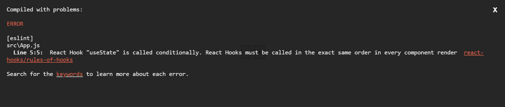
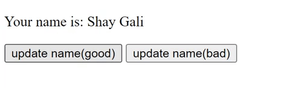

# useState Hook

<div dir="rtl">

## מה זה useState

useState זה הדרך שלנו להשתמש במשתנים שיכולים להשתנות בזמן הריצה.

בא להחליף את this.state שבו השתמשנו ב class component, בנוסף הstate לא חייב להיות אובייקט.

קריאה לפונקציה useState תחזיר לנו מערך ובעזרת Array destructuring נוכל לקבל את הערכים שהיא מחזירה.

היא תחזיר לנו את המשתנה state עצמו, ופונקציה שתאפשר לנו לשנות את הערך של אותו state.

אפשר להעביר ערך שבו המשתנה יאותחל. אם לא נעביר הוא יאותחל להיות undefined.
<div dir="ltr">

```js
const [state, setState] = useState(initialState)
```

</div>

## initialState כבד

אם החישוב של ה initialState הוא כבד ודורש הרבה משאבים, אפשר לאתחל את ה state בעזרת פונקציה וככה הוא לא ייקרא ל
initialState כל רינדור, אלא רק בפעם הראשונה.
<div dir="ltr">

```js
const [state, setState] = useState(() => {
  return heavyClacFunction()
})
```

</div>

### דוגמא

הגדרנו פונקציה חיצונית שבסך הכל מדפיסה init, ומחזירה 4
<div dir="ltr">

```js
function initState() {
  console.log("init")
  return 0
}
```

</div>

עכשיו נקרא לה בפונקציה של ה useState:
<div dir="ltr">

```js
  const [counter, setCounter] = useState(initState());
```

</div>

עכשיו נראה מה קורא כל פעם שיש שינוי ב state:
<div dir="ltr">


</div>
אפשר שכל פעם שמשנים את הstate גם הפונקציה נקראת.

אבל אם נקרא לפונקציה הזאת בתוך הפונקציית חץ הפונקציה initState תרוץ רק ברנדור הראשון:
<div dir="ltr">

```js
  const [counter, setCounter] = useState(() => initState());
```


</div>

## איך לא להשתמש ב useState

כל hook חייב להיות מאותחל בתוך הפונקציה עצמה, והוא לא יכול לרוץ מתוך פונקציות אחרות או תנאים.

אם ננסה לעשות את זה הוא יזרוק לנו שגיאה.
<div dir="ltr">

```js
  if (true) {
  useState();
}
```


</div>

## שינוי ערך על בסיס ערך קודם

אם אנחנו משנים את הערך של ה state בתוך ה set שלו, עדיף להשתמש בפונקציית חץ שמקבלת את הערך הקודם.

**(אפשר לראות בקוד דוגמא למה יכול לקרות)**
<div dir="ltr">

```js
Good:
  setCount(prevCount => prevCount + 1)

Bad:
  setCount(count + 1)
```

</div>

## object state

בדרך כלל ב useState אנחנו נגדיר ערכים ממש ולא אובייקטים עם כמה ערכים (בניגוד ל class component).

אם בכל זאת נרצה להגדיר אובייקט ב useState צריך לשים לדבר לדבר הבא:

לדוגמא נגדיר את הsate הבא:
<div dir="ltr">

```js
const [name, setName] = useState({fName: "Shay", lName: "Gali"});
```

</div>

ב class component אם היינו רוצים לעדכן את ה fName היינו פשוט עושים
<div dir="ltr">

```js
setState({fName: "yossi"})
```

</div>

אבל זה לא עובד ככה ב useState. אם נעשה ככה הוא ידרוס את הערך הקודם. לכן אפשר להשתמש ב spread operator (...) כדי לעדכן את ה state:
<div dir="ltr">

```js
Good:
  setName(prevName => ({...prevName, fName: "Yossi"}))

Bad:
  setName({fName: "Yossi"})
```

</div>
אפשר לראות שהכפתור הראשון (עם ה ...) מעדכן את הערך של הstate כמו שצריך, לעומת זאת השני פשוט דורס את מה שהיה שם קודם ומשאיר רק את fName.



הדרך הנכונה לנהל את ה state כאן תהיה ככה:
<div dir="ltr">

```js
const [fName, setFName] = useState("Shay");
const [lName, setLName] = useState("Gali");
```

</div>

</div>
