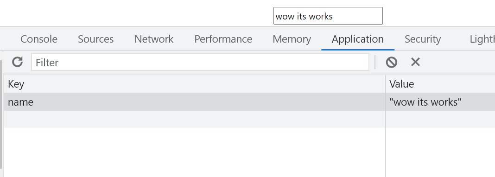
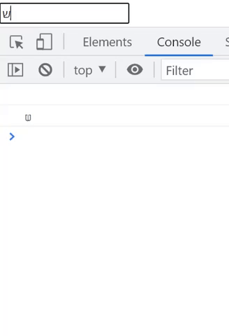

# custom hooks

<div dir="rtl"> 
מאפשר לנו לאחד לוגיקה, ולהשתמש מחדש באותה לוגיקה, בצורה של hook.

> לא חובה להשתמש ב use... בתור השם ל hook שלנו, אבל זה טוב כי ריאקט תוכל לעשות בידקות שלה ולעזור לנו

## useLocalStorage

כדי שיהיה לנו יותר נוח להשתמש ב localStorage נוכל ליצור hook שהוא ידאג לזה

<div dir="ltr">

### implement

```js
import {useState, useEffect} from "react";

// מחזיר את הערך מה-localStorage לפי ה key אם הוא קיים, אם לא הוא מחזיר את ה initValue
function getSavedValue(key, initValue) {
  const savedValue = JSON.parse(localStorage.getItem(key));
  if (savedValue) return savedValue;
  if (initValue instanceof Function) return initValue(); // initValue can be function - like useState(()=> "")
  return initValue;
}

export default function useLocalStorage(key, initState) {
  const [value, setValue] = useState(() => {
    return getSavedValue(key, initState);
  });

  useEffect(() => { // Keeps track on changes in the value of a variable, and saves the change to the localStorage
    localStorage.setItem(key, JSON.stringify(value));
  }, [value]);

  return [value, setValue];
}
```

### use

```js
const [name, setName] = useLocalStorage("name", "");
// or with function as initisilizer
const [name, setName] = useLocalStorage("name", () => "");
```


</div>

## useUpdateLogger

נגיד נרצה לעקוב אחרי שינויים במשתנה, ולהדפיס כל פעם שיש שינוי.

עכשיו כל משתנה שנרצה לעקוב אחרי נוכל לעשות את זה בשורה אחת, וזה יהיה יותר מובן

<div dir="ltr">

### implement

```js
import {useEffect} from "react";

export default function useUpdateLogger(value) {
  useEffect(() => {
    console.log(value);
  }, [value]);
}

```

### use

```js
useUpdateLogger(name);
```


</div>


</div>